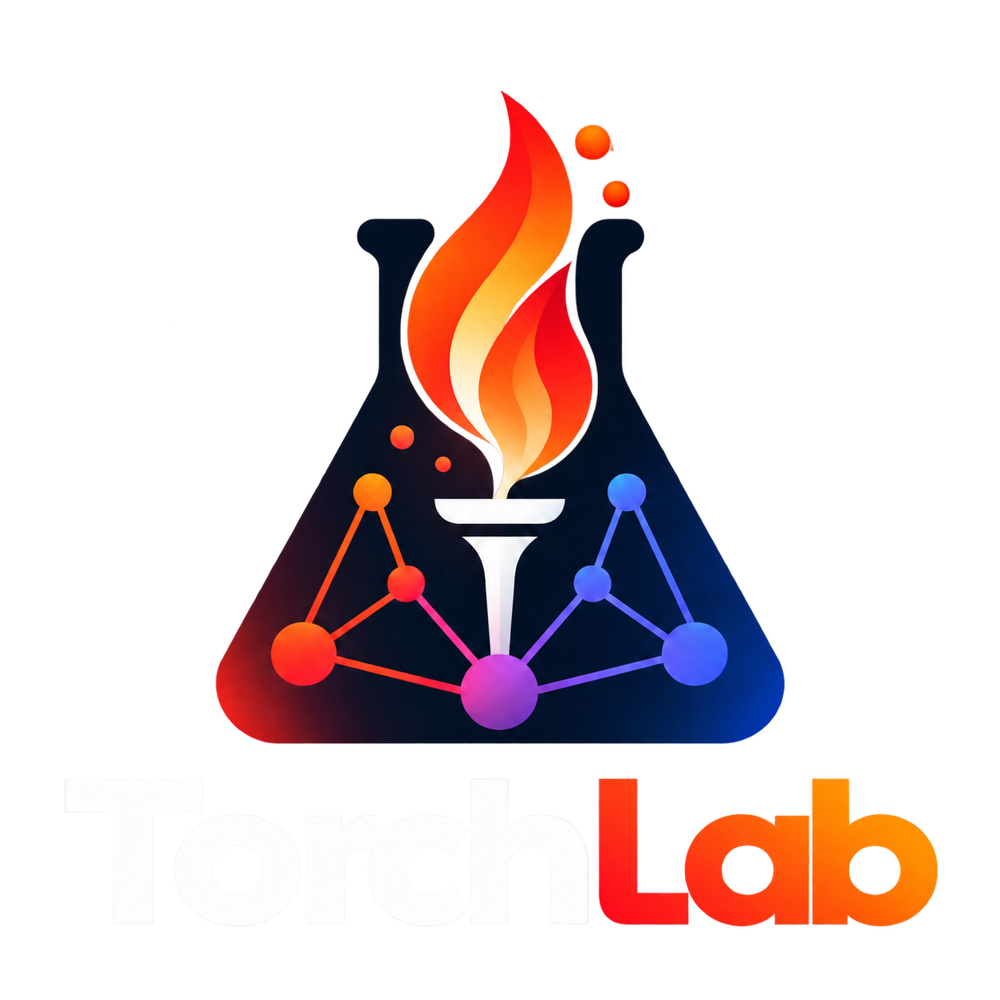

<p align="center">
  <picture>
    <source media="(prefers-color-scheme: dark)" srcset="assets/torchlab-light.png" />
    <source media="(prefers-color-scheme: light)" srcset="assets/torchlab-dark.png" />
    
  </picture>
</p>

<h3 align="center">Deep Learning, From First Principles to Research</h3>

<p align="center">
  A hands-on machine learning and deep learning laboratory.<br/>
  Understand the mathematics. Build the models. Reproduce the papers. Build the framework.
</p>

<p align="center">
  <a href="https://github.com/Esmail-ibraheem/TorchLab">
    
  </a>
  <a href="04-papers-in-pytorch/">
    
  </a>
  <a href="05-torch-from-scratch/">
    
  </a>
</p>


---

## What is TorchLab?

**TorchLab** is my personal, open-source laboratory for understanding machine learning and deep learning by implementing them.

The goal is to go beyond using existing frameworks or copying model architectures. I want to understand how learning algorithms work mathematically, how PyTorch implements them, how modern research architectures are constructed, and ultimately how to build the underlying deep learning framework myself.

The repository follows six connected stages:

1. **Machine learning:** Study classical ML algorithms and implement them from scratch using NumPy.
2. **Deep learning theory:** Derive the mathematics behind neural networks, optimization, backpropagation, and modern architectures.
3. **PyTorch:** Understand tensors, automatic differentiation, model development, training, and the framework's internals.
4. **Research implementations:** Read and reproduce influential deep learning papers using PyTorch.
5. **Torch from scratch:** Build a minimal deep learning framework, from automatic differentiation to neural network layers and optimizers.
6. **Research on our framework:** Reimplement the previously studied architectures using the custom framework and compare their behavior against PyTorch.

The repository is a **work in progress**. It currently contains several research implementations, a growing paper catalog, learning roadmaps, and the first component of the custom framework. The six stages describe both what is available today and where the laboratory is heading.

---

## The learning path

```text
                    TORCHLAB
                       │
                       ▼
           ┌───────────────────────┐
           │ 01. Machine Learning  │
           │ Mathematics + NumPy   │
           └───────────┬───────────┘
                       ▼
           ┌───────────────────────┐
           │ 02. Deep Learning     │
           │ Theory & Derivations  │
           └───────────┬───────────┘
                       ▼
           ┌───────────────────────┐
           │ 03. PyTorch           │
           │ Framework & Training  │
           └───────────┬───────────┘
                       ▼
           ┌───────────────────────┐
           │ 04. Research Papers   │
           │ PyTorch Reproductions │
           └───────────┬───────────┘
                       ▼
           ┌───────────────────────┐
           │ 05. Torch From Scratch│
           │ Our Own Framework     │
           └───────────┬───────────┘
                       ▼
           ┌───────────────────────┐
           │ 06. Research Papers   │
           │ On Our Own Framework  │
           └───────────────────────┘
```

### Explore the six stages

| Stage | Focus | Current status |
|:---|:---|:---|
| [01 · Machine Learning](01-machine-learning/) | Classical ML, mathematical foundations, and NumPy implementations | Syllabus |
| [02 · Deep Learning Theory](02-deep-learning-theory/) | Neural networks, backpropagation, optimization, and architecture derivations | Syllabus |
| [03 · PyTorch](03-pytorch/) | PyTorch fundamentals, training, performance, and internals | Syllabus |
| [04 · Papers in PyTorch](04-papers-in-pytorch/) | Paper explanations, implementations, experiments, and a research catalog | Active |
| [05 · Torch From Scratch](05-torch-from-scratch/) | Custom autograd, tensors, neural network layers, optimizers, and backends | In progress |
| [06 · Papers in Torch From Scratch](06-papers-in-torch-from-scratch/) | Reproducing research architectures with the custom framework | Planned |

---

## 01 · Machine Learning

**Understanding the algorithms before using deep learning frameworks.**

This stage is dedicated to classical machine learning, starting with mathematical intuition and progressing toward implementations using NumPy.

The [machine learning syllabus](01-machine-learning/) covers:

- Linear and logistic regression
- Gradient descent and optimization
- Regularization, generalization, and model evaluation
- K-nearest neighbors, Naive Bayes, and support vector machines
- Decision trees, random forests, and ensemble methods
- K-means, Gaussian mixtures, and principal component analysis
- Probability and information theory

The intended structure for each topic is a mathematical explanation, an implementation, and experiments on small datasets.

**Status:** The syllabus is available. Individual topic implementations are planned.

---

## 02 · Deep Learning Theory

**Understanding what happens inside a neural network.**

This stage focuses on mathematical derivations, computational graphs, and the theoretical foundations that connect classical neural networks to modern architectures.

Topics in the [deep learning theory syllabus](02-deep-learning-theory/) include:

- Perceptrons, multilayer perceptrons, and activation functions
- Backpropagation and the chain rule
- Optimization, initialization, and normalization
- Convolutional and recurrent neural networks
- Attention mechanisms and Transformers
- Tokenization and embeddings
- VAEs, GANs, and diffusion models
- Reinforcement learning and preference optimization
- Model scaling and efficiency

The goal is to understand not only how these methods work, but also why their design choices matter.

**Status:** The theoretical learning roadmap is available. Dedicated topic modules are planned.

---

## 03 · PyTorch

**Learning the framework that powers the research implementations.**

This stage studies PyTorch from fundamental tensor operations to the systems used for training and inference.

The [PyTorch syllabus](03-pytorch/) covers tensors, autograd, `nn.Module`, data pipelines, training loops, mixed precision, profiling, distributed training, custom CUDA/Triton kernels, and model inference.

The objective is twofold: use PyTorch effectively for research, and understand its abstractions well enough to rebuild a smaller version in Stage 05.

**Status:** The syllabus is available. Dedicated framework tutorials and examples are planned.

---

## 04 · Research Papers in PyTorch

**From a published paper to an understandable, working implementation.**

This is the main implementation-focused section of TorchLab.

It combines explanations of research ideas with PyTorch code, model architectures, and practical examples.


### Research paper catalog

Beyond the existing packages, TorchLab maintains a larger reading and implementation catalog.

The catalog covers foundational neural networks, optimization, computer vision, Transformers, generative models, speech, and reinforcement learning.

It includes papers collected from research and educational resources, including Geoffrey Hinton's publications and the work covered by Umar Jamil, Priyam Mazumdar, and Aladdin Persson.

**Important:** Papers in the catalog are research and implementation candidates. Inclusion does not mean a paper has already been reproduced.

[Browse the full research paper catalog →](04-papers-in-pytorch/)

---

## 05 · Torch From Scratch

**Building the abstractions behind deep learning frameworks, one component at a time.**

Using PyTorch is one thing. Understanding how automatic differentiation, tensors, neural network layers, and optimizers are implemented is another.

The goal of this stage is to develop a small, educational, PyTorch-inspired framework that can eventually run the architectures implemented in Stage 04.

### Current implementation

The first available component is:

**[Forward-mode automatic differentiation with dual numbers](05-torch-from-scratch/autograd/forward-mode-dual-numbers/)**

This introduces dual-number arithmetic and tangent propagation as a foundation for understanding automatic differentiation.

### Framework roadmap

| Component | Scope | Status |
|:---|:---|:---|
| Forward-mode autograd | Dual numbers and tangent propagation | Done |
| Reverse-mode autograd | Computational graphs, backward passes, and VJPs | Planned |
| Tensor engine | N-dimensional storage, broadcasting, views, and matrix operations | Planned |
| Tensor autograd | Differentiation over tensor operations | Planned |
| Neural network API | Modules, parameters, layers, and activations | Planned |
| Loss functions | MSE, cross-entropy, and numerical stability | Planned |
| Optimizers | SGD, momentum, Adam, and AdamW | Planned |
| Data utilities | Datasets, batching, and data loading | Planned |
| Attention | Scaled dot-product attention, multi-head attention, and caching | Planned |
| Backends | NumPy backend, followed by GPU exploration | Planned |
| Testing | Numerical gradient checks and PyTorch comparisons | Planned |

As the components mature, the intention is to assemble them into a reusable, importable framework.

This is an educational framework under development, not a replacement for production PyTorch.

[Explore Torch From Scratch →](05-torch-from-scratch/)

---

## 06 · Research Papers on Our Own Framework

**Closing the loop: implementing research architectures using the framework we built ourselves.**

The final stage aims to reproduce selected Stage 04 implementations without relying on PyTorch for their core model operations.

The intended progression is:

1. Build the required tensor, differentiation, and neural network primitives.
2. Reimplement the selected model using the custom framework.
3. Validate numerical behavior and gradients against PyTorch.
4. Compare training behavior, performance, and implementation complexity.

The initial direction is to revisit architectures already studied in the laboratory, beginning with their fundamental components.

**Status:** Roadmap. This stage depends on the development of the Stage 05 framework.

[Explore the roadmap →](06-papers-in-torch-from-scratch/)

---

## Repository structure

```text
TorchLab/
│
├── 01-machine-learning/
│   └── README.md                   Classical ML syllabus
│
├── 02-deep-learning-theory/
│   └── README.md                   Deep learning theory syllabus
│
├── 03-pytorch/
│   └── README.md                   PyTorch learning syllabus
│
├── 04-papers-in-pytorch/
│   ├── README.md                   Research catalog and package status
│   ├── transformer/
│   │   ├── transformer/            Transformer model and notebooks
│   │   └── translator/             English → Arabic translation
│   ├── llama/
│   │   ├── x_llama/                Llama-style model and inference
│   │   └── models/                 Attention and rotary embeddings
│   ├── diffusion/                  Diffusion and Stable Diffusion
│   └── rlhf/
│       └── motion/                 Motion Canvas animation source
│
├── 05-torch-from-scratch/
│   ├── README.md                   Custom framework roadmap
│   └── autograd/
│       └── forward-mode-dual-numbers/
│
├── 06-papers-in-torch-from-scratch/
│   └── README.md                   Future research implementations
│
├── website/                         Vue + Vite website
├── assets/                          TorchLab branding
└── README.md
```

The tree highlights the main learning and implementation areas; individual packages contain additional source files, notebooks, and assets.

---

## Getting started

Clone the repository:

```bash
git clone https://github.com/Esmail-ibraheem/TorchLab.git
cd TorchLab
```

### Explore an existing model

Start with the Transformer implementation:

```bash
cd 04-papers-in-pytorch/transformer
```

Read the package's `README.md` to understand the architecture, then explore the model code, notebooks, and translation example.

Other available research packages can be found under `04-papers-in-pytorch/`.

### Explore the custom framework

Return to the repository root and open:

```bash
cd 05-torch-from-scratch/autograd/forward-mode-dual-numbers
```

This contains the first automatic differentiation component.

Installation and execution details may differ between packages. Consult each package's documentation and dependency files where available.

---

## Development roadmap

TorchLab is an evolving learning and research project.

The next areas of development are:

- [ ] Expand classical machine learning implementations in NumPy.
- [ ] Add detailed deep learning derivations and numerical experiments.
- [ ] Develop the PyTorch learning modules.
- [ ] Expand the research paper implementation catalog.
- [ ] Add PPO and DPO fine-tuning implementations to the RLHF package.
- [x] Implement forward-mode automatic differentiation with dual numbers.
- [ ] Implement reverse-mode automatic differentiation.
- [ ] Build the tensor engine and neural network API.
- [ ] Add optimizers, data utilities, and tests.
- [ ] Assemble the components into an importable deep learning framework.
- [ ] Reimplement selected research architectures on that framework.

The objective is not simply to collect more models, but to build a connected body of theory, implementations, experiments, and framework internals.

---

## Contributing

TorchLab is a personal learning laboratory, but contributions, suggestions, corrections, and discussions are welcome.

Potential contributions include improving mathematical explanations, identifying bugs in existing implementations, adding tests, proposing research papers, or extending the educational material.

If you find an issue or have an idea, feel free to open an issue or pull request.

---

## References and inspiration

TorchLab draws on research papers, open-source implementations, and educational resources.

Some foundational resources include:

- [PyTorch documentation](https://pytorch.org/docs/)
- [Deep Learning — Goodfellow, Bengio & Courville](https://www.deeplearningbook.org/)
- [Dive into Deep Learning](https://d2l.ai/)
- [Andrej Karpathy's micrograd](https://github.com/karpathy/micrograd)
- [MiniTorch](https://minitorch.github.io/)
- [Attention Is All You Need](https://arxiv.org/abs/1706.03762)
- [Llama 2](https://arxiv.org/abs/2307.09288)
- [Denoising Diffusion Probabilistic Models](https://arxiv.org/abs/2006.11239)

Individual packages include their own paper references and implementation details.

---

<p align="center">
  <b>TorchLab — Understand it. Implement it. Rebuild it.</b>
</p>

<p align="center">
  Built by <a href="https://github.com/Esmail-ibraheem">Esmail Gumaan</a>
</p>
